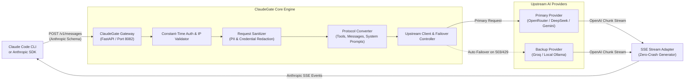

<p align="center">
  
</p>

<h1 align="center">ClaudeGate</h1>

<p align="center">
  <strong>Use Claude Code CLI with ANY AI model — DeepSeek, Gemini, Groq, OpenRouter, or 100% offline with Ollama.</strong><br>
  <em>A simple, fast local API bridge that translates Claude Code requests to standard OpenAI-compatible endpoints.</em>
</p>

<p align="center">
  
  
  
  
</p>

---

## 💡 In Simple Words: What is ClaudeGate?

### ❓ The Problem
[Claude Code CLI](https://docs.anthropic.com/en/docs/agents-and-tools/claude-code/overview) is an amazing command-line tool that can read your codebase, edit files, and run terminal commands. But by default:
- It **only** works with Anthropic's official Claude models.
- It **requires** paid Anthropic API credits.
- You **cannot** use local offline models or other providers like DeepSeek, Gemini, or Groq.

### 💡 The Solution (ClaudeGate)
**ClaudeGate is a free, local middleman (API proxy).** 

It runs on your computer and sits between Claude Code and whatever AI model you want to use. When Claude Code sends a request meant for Anthropic, ClaudeGate automatically translates it into the OpenAI format that virtually all modern AI models understand.

```text
┌─────────────────┐       Anthropic Format       ┌─────────────────┐       OpenAI Format       ┌──────────────────────────────┐
│ Claude Code CLI │ ───────────────────────────► │   ClaudeGate    │ ────────────────────────► │ Any Model / Provider         │
│  (in your repo) │ ◄─────────────────────────── │ (runs on :8082) │ ◄──────────────────────── │ (DeepSeek, Ollama, Groq, etc)│
└─────────────────┘      Anthropic Events        └─────────────────┘       Streamed Chunks     └──────────────────────────────┘
```

### ❌ What ClaudeGate is NOT
- ❌ **NOT an agent orchestrator** (like LangGraph or CrewAI). Claude Code itself is the agent; ClaudeGate is just the communication bridge.
- ❌ **NOT a test harness or benchmark tool**. It does not score or evaluate models.
- ❌ **NOT a cloud service**. Everything runs locally on your machine (`127.0.0.1:8082`).

---

## ⚡ Quick Start (Get running in 3 minutes)

### Step 1: Clone & Install
```bash
git clone https://github.com/Santosh-Prasad-Verma/ClaudeGate.git
cd ClaudeGate

python3 -m venv .venv
source .venv/bin/activate
pip install -r requirements.txt
```

### Step 2: Choose Your AI Provider
Load a ready-to-use preset for your preferred provider:

```bash
# Example: Use OpenRouter (Claude, DeepSeek, GPT, etc.)
python start_proxy.py --preset openrouter

# Or use Groq (Ultra-fast inference)
python start_proxy.py --preset groq

# Or use 100% Free & Local Ollama (No API key needed!)
python start_proxy.py --preset ollama

# Or run the interactive setup wizard to configure any custom model
python start_proxy.py --setup
```

*(If using cloud providers, open `.env` and paste your `UPSTREAM_API_KEY`)*

### Step 3: Tell Claude Code to use ClaudeGate
Add this to your `~/.claude/settings.json` (or set in your terminal):
```json
{
  "env": {
    "ANTHROPIC_BASE_URL": "http://127.0.0.1:8082",
    "ANTHROPIC_API_KEY": "sk-claudegate-local"
  }
}
```

### Step 4: Start ClaudeGate & Code!
```bash
# Terminal 1: Start ClaudeGate
python start_proxy.py

# Terminal 2: In any coding project, start Claude Code
claude
```

🎉 **That's it! Claude Code CLI is now powered by your custom backend.**

---

## 📑 Table of Contents

- [💡 In Simple Words: What is ClaudeGate?](#-in-simple-words-what-is-claudegate)
- [⚡ Quick Start (Get running in 3 minutes)](#-quick-start-get-running-in-3-minutes)
- [✨ Key Features](#-key-features)
- [🔌 Supported Providers & Presets](#-supported-providers--presets)
- [🏗️ Architecture & How It Works](#️-architecture--how-it-works)
- [📁 Project Structure](#-project-structure)
- [⚙️ Full Configuration Guide](#️-full-configuration-guide)
- [🚀 Daily Workflow & Examples](#-daily-workflow--examples)
- [🧪 Testing & Diagnostics](#-testing--diagnostics)
- [🔒 Security & Privacy](#-security--privacy)
- [💡 Engineering Deep-Dive](#-engineering-deep-dive)
- [🤝 Contributing & License](#-contributing--license)

---

## ✨ Key Features

- 🔄 **Real-Time Protocol Translation**: Seamlessly converts Anthropic message blocks, tool definitions, and tool execution results into OpenAI function calls and back.
- ⚡ **Zero-Crash Streaming**: Translates raw streaming chunks into Anthropic Server-Sent Events (`content_block_delta`, `message_stop`) without crashes or broken sockets.
- 🛡️ **Secret & PII Sanitizer**: Automatically scrubs sensitive data (API keys, AWS tokens, GitHub PATs, SSH keys) from outgoing prompts before they leave your machine (`SANITIZE_SECRETS=true`).
- 🧹 **Chain-of-Thought / `<thinking>` Filter**: Strips reasoning tokens from history so multi-turn reasoning models (like DeepSeek R1) don't trigger `400 Bad Request` errors on follow-up turns.
- 🔀 **Automatic Provider Failover**: If your primary provider hits a rate limit (`429`) or server outage (`503`), ClaudeGate automatically retries with your backup provider without breaking your session.
- 🎛️ **24+ Ready-Made Presets**: Instant one-command configuration for every popular AI provider.
- 🐳 **Docker & Compose Ready**: Run as a self-contained local container with one command.

---

## 🔌 Supported Providers & Presets

ClaudeGate works with any OpenAI-compatible endpoint. Ready-made presets include:

| Provider Preset | Typical Models / Use Case |
|---|---|
| `openrouter.env` | OpenRouter (Claude 3.7 Sonnet, DeepSeek V3/R1, GPT-4o) |
| `groq.env` | Groq (Llama 3.3 70B, DeepSeek R1 Distill - lightning speed) |
| `ollama.env` | Ollama (100% local & private — zero data leaves your computer) |
| `deepseek.env` | Official DeepSeek API (V3 and R1) |
| `gemini.env` | Google Gemini (Gemini 2.5 Flash / 2.0 Pro) |
| `openai.env` | OpenAI Official (GPT-4o, o1, o3-mini) |
| `lmstudio.env` / `vllm.env` | Local self-hosted GPU rigs and desktop runners |
| `mistral.env` | Mistral AI (Mistral Large, Codestral) |
| `qwen.env` | Alibaba DashScope (Qwen 2.5 Coder 32B / Max) |
| `together.env` / `fireworks.env` | Together AI, Fireworks AI |
| `azure.env` | Microsoft Azure OpenAI deployments |

To switch presets:
```bash
python start_proxy.py --preset <name>
```

---

## 🏗️ Architecture & How It Works

ClaudeGate acts as a transparent translation gateway:



---

## 📁 Project Structure

```text
ClaudeGate/
├── presets/                   # 24+ pre-configured provider environment files
├── scripts/                   # Verification and testing scripts
├── src/
│   ├── main.py                # FastAPI application entry point
│   ├── cli.py                 # CLI wizard, tester, and preset loader
│   ├── api/
│   │   └── endpoints.py       # /v1/messages, /health, /count_tokens routes
│   ├── conversion/
│   │   ├── request_converter.py   # Translates Anthropic requests -> OpenAI
│   │   ├── response_converter.py  # Translates OpenAI streams -> Anthropic SSE
│   │   └── schema_sanitizer.py    # Sanitizes tool schemas & types
│   ├── core/
│   │   ├── client.py          # HTTP client with automatic retry & failover
│   │   ├── config.py          # App configuration & environment loader
│   │   └── model_manager.py   # Model tier routing (BIG, MIDDLE, SMALL)
│   ├── models/                # Pydantic data schemas
│   └── security/
│       └── sanitizer.py       # PII, API key, and secret scrubber
├── start_proxy.py             # Launcher script for CLI and server
├── requirements.txt           # Python dependencies
└── pyproject.toml             # Project metadata & test configuration
```

---

## ⚙️ Full Configuration Guide

### Option 1: Using Presets (Fastest)
```bash
python start_proxy.py --preset deepseek
```
Then edit `.env` to supply your API key:
```dotenv
UPSTREAM_API_KEY=sk-your-actual-api-key
```

### Option 2: Interactive Wizard
```bash
python start_proxy.py --setup
```
This will guide you step-by-step through choosing a provider, model names, and optional failover targets.

### Option 3: Manual `.env` Configuration
Here is an example `.env` file:
```dotenv
# ClaudeGate Server
PORT=8082
HOST=127.0.0.1
AUTH_TOKEN=sk-claudegate-local

# Primary Upstream Provider
UPSTREAM_BASE_URL=https://api.deepseek.com/v1
UPSTREAM_API_KEY=sk-your-deepseek-key

# Model Tier Mappings (Routes Claude requests to your chosen models)
BIG_MODEL=deepseek-chat
MIDDLE_MODEL=deepseek-chat
SMALL_MODEL=deepseek-chat

# Safety & Privacy
SANITIZE_SECRETS=true
```

---

## 🚀 Daily Workflow & Examples

### Everyday Usage
1. **Start the Proxy**:
   ```bash
   cd ClaudeGate
   python start_proxy.py
   ```
2. **Open your project & run Claude**:
   ```bash
   cd /path/to/your/project
   claude
   ```
3. Ask Claude Code to do work as usual:
   ```text
   > "Fix the failing test in tests/test_auth.py and commit the change"
   ```
   Claude Code will use its normal tools (file read, file edit, bash commands), but all reasoning and generation will be executed by your chosen backend model!

### Useful CLI Commands
| Command | What it does |
|---|---|
| `python start_proxy.py` | Start the ClaudeGate server |
| `python start_proxy.py --test` | Test upstream connection & measure latency |
| `python start_proxy.py --setup` | Run the interactive setup wizard |
| `python start_proxy.py --preset <name>` | Switch provider preset (e.g. `ollama`, `groq`) |
| `python start_proxy.py --help` | Show all available options |

### Running with Docker
```bash
docker compose up -d --build
```

---

## 🧪 Testing & Diagnostics

### 1. Test Upstream Connection
Verify that your API keys and provider endpoints are working:
```bash
python start_proxy.py --test
```

### 2. Run Test Suite
Run the 22 automated test cases:
```bash
pytest
```

---

## 🔒 Security & Privacy

- **Localhost Only**: Listens on `127.0.0.1` by default so nobody on your local network can access your proxy.
- **Constant-Time Token Validation**: Validates client headers using Python's `hmac.compare_digest` to prevent timing attacks.
- **Local Secret Redaction**: When `SANITIZE_SECRETS=true`, ClaudeGate scrubs AWS tokens, GitHub PATs, and SSH keys from prompts before sending them across the internet.

---

## 💡 Engineering Deep-Dive

For developers interested in the internals:

1. **Error Markers over Generator Exceptions**:
   Raising exceptions inside Starlette streaming responses after headers are flushed causes `RuntimeError: response already started`. ClaudeGate instead yields structured `ERROR::<status>::<message>` tokens that the SSE generator translates into graceful Anthropic error frames.
2. **Multi-Turn Reasoning Filter**:
   Models like DeepSeek R1 output internal reasoning thoughts. If these `<thinking>` blocks are sent back in subsequent conversation turns, OpenAI endpoints fail with `400 Bad Request`. ClaudeGate automatically cleanses reasoning tags from history.
3. **10-Minute TCP Keep-Alive**:
   Node.js HTTP agents drop idle connections if a user pauses while typing. ClaudeGate sets `timeout_keep_alive=600` to prevent premature `ECONNRESET` disconnects.
4. **Tool Schema Type Sanitization**:
   Different OpenAI-compatible providers reject schemas with complex type unions (e.g. `type: ["string", "null"]`). ClaudeGate normalizes these into strict single-type schemas with `nullable: true`.

---

## 🤝 Contributing & License

Contributions are welcome! Feel free to submit PRs for new provider presets, bug fixes, or documentation improvements.

- **License**: [MIT License](LICENSE)
- **Security Inquiries**: See [SECURITY.md](SECURITY.md)
- **Code of Conduct**: See [CODE_OF_CONDUCT.md](CODE_OF_CONDUCT.md)

<p align="center">
  ⭐ <strong>If ClaudeGate helps your workflow, please star the repository on GitHub!</strong> ⭐
</p>
