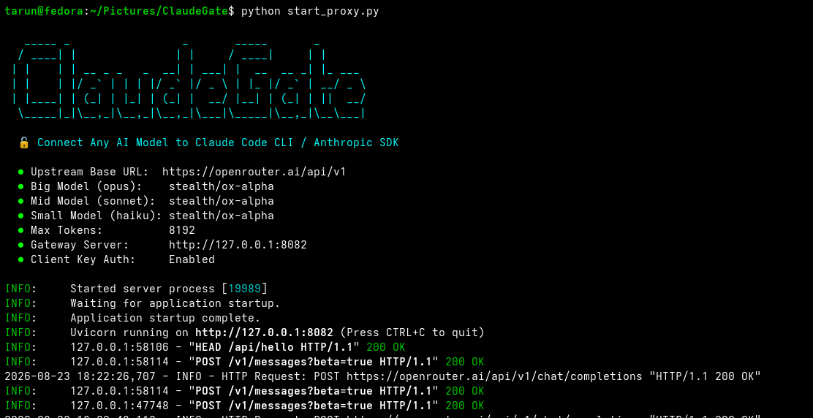
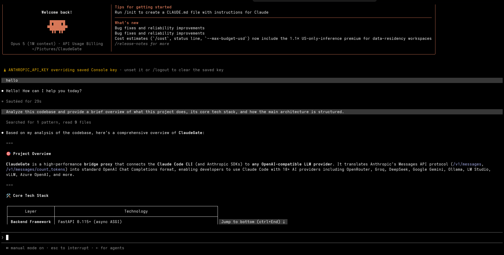

<p align="center">
  
</p>

<h1 align="center">ClaudeGate</h1>

<p align="center">
  <strong>Use Claude Code CLI with ANY AI Model — 100% Free, Local, or Cloud.</strong><br>
  <em>A fast, lightweight local bridge that connects Anthropic's Claude Code CLI to DeepSeek, Ollama, OpenAI, Gemini, Groq, OpenRouter, and more.</em>
</p>

<p align="center">
  
  
  
  
</p>

---

## 🌟 What is ClaudeGate?

[Claude Code CLI](https://docs.anthropic.com/en/docs/agents-and-tools/claude-code/overview) is an incredible terminal assistant made by Anthropic that can read your files, write code, run terminal commands, and fix bugs autonomously. 

However, **Claude Code is normally locked to Anthropic's official Claude models**, which require paid Anthropic API credits and cannot run offline.

**ClaudeGate is a local translator for your computer.** It sits quietly in the background on your machine. When Claude Code sends a request, ClaudeGate translates it in real-time into standard OpenAI format, sends it to **any AI provider of your choice**, and streams the answer right back to your terminal.

```text
┌─────────────────┐       ┌─────────────────┐       ┌───────────────────────────────┐
│                 │       │                 │       │  Any AI Model You Choose:     │
│ Claude Code CLI │ ────► │   ClaudeGate    │ ────► │  • 🆓 Free Cloud (DeepSeek/Groq)│
│ (In your repo)  │ ◄──── │ (Local Proxy)   │ ◄──── │  • 🔒 100% Local (Ollama)     │
│                 │       │                 │       │  • ⚡ Cloud (OpenAI/Gemini/OR) │
└─────────────────┘       └─────────────────┘       └───────────────────────────────┘
```

Claude Code gets the full power of an autonomous coding agent, while you get complete freedom over which AI model powers it!

---

## 💡 Why Use ClaudeGate?

| 🚫 Without ClaudeGate | ✨ With ClaudeGate |
|---|---|
| Locked only to Anthropic Claude models | Use **any AI model**: DeepSeek, OpenAI, Gemini, Qwen, Mistral, etc. |
| Must pay Anthropic API credit rates | Use **free tiers**, low-cost providers, or your existing API keys |
| All your code is sent to Anthropic's cloud | Run **100% offline & private** on your own computer with **Ollama** |
| Session crashes if an API rate-limit hits | **Automatic failover**: switches to a backup model seamlessly |
| Risk of accidental API key leaks in prompts | **Secret Redaction**: scrubs passwords, tokens, and SSH keys automatically |

---

## 📸 See It In Action

ClaudeGate actively translating Claude Code commands, tool calls, and streaming responses in real time:

<div align="center">
  <table>
    <tr>
      <td align="center" width="50%">
        <strong>⚡ 1. ClaudeGate Running in Terminal 1</strong><br>
        
      </td>
      <td align="center" width="50%">
        <strong>🤖 2. Claude Code Working in Terminal 2</strong><br>
        
      </td>
    </tr>
  </table>
</div>

---

## ⚡ Quick Start (Up & Running in 3 Minutes)

### Step 1: Install ClaudeGate

```bash
# Clone the repository
git clone https://github.com/Santosh-Prasad-Verma/ClaudeGate.git
cd ClaudeGate

# Set up Python virtual environment
python3 -m venv .venv
source .venv/bin/activate

# Install requirements
pip install -r requirements.txt
```

---

### Step 2: Choose Your AI Provider

You can configure your AI provider in **one command**:

#### Option A: Interactive Setup Wizard
```bash
python start_proxy.py --setup
```
*Follow the on-screen menu to choose from 24+ providers (Ollama, DeepSeek, Groq, Gemini, OpenRouter, etc.) and enter your API key.*

#### Option B: Load a Preset Directly
```bash
# For 100% Free / Local Ollama (no API key needed!):
python start_proxy.py --preset ollama

# For DeepSeek Official:
python start_proxy.py --preset deepseek

# For Groq (Ultra-Fast):
python start_proxy.py --preset groq

# For Google Gemini:
python start_proxy.py --preset gemini

# For OpenRouter:
python start_proxy.py --preset openrouter
```
*(If the provider requires an API key, edit `.env` and paste your key).*

---

### Step 3: Tell Claude Code to Use ClaudeGate

Configure Claude Code to talk to ClaudeGate (`http://127.0.0.1:8082`) instead of Anthropic:

#### 🔹 Permanent Setup (Recommended)
Add this to your Claude Code settings file (`~/.claude/settings.json`):
```json
{
  "env": {
    "ANTHROPIC_BASE_URL": "http://127.0.0.1:8082",
    "ANTHROPIC_API_KEY": "sk-claudegate-local"
  }
}
```

#### 🔹 Temporary Setup (Current Terminal Window Only)
Run these commands in your terminal before launching Claude:
```bash
export ANTHROPIC_BASE_URL="http://127.0.0.1:8082"
export ANTHROPIC_API_KEY="sk-claudegate-local"
```

---

### Step 4: Test & Run!

1. **Verify your connection:**
   ```bash
   python start_proxy.py --test
   ```
   *You should see `✅ Connection Successful!`.*

2. **Start ClaudeGate (keep this running in Terminal 1):**
   ```bash
   python start_proxy.py
   ```

3. **Open another terminal in your project (Terminal 2) and code with Claude:**
   ```bash
   cd ~/path/to/my-coding-project
   claude
   ```

🎉 **That's it!** You can now give instructions like *"Refactor the auth module and add unit tests"* and Claude Code will execute them using your chosen backend AI model!

---

## 🎮 Everyday Workflow

Here is what your normal daily coding routine looks like:

```text
┌─────────────────────────────────────────────────────────────────────────────┐
│  TERMINAL 1: Run ClaudeGate                                                 │
│  $ cd ClaudeGate && python start_proxy.py                                   │
│  ➜ ClaudeGate is listening on http://127.0.0.1:8082                         │
└──────────────────────────────────────┬──────────────────────────────────────┘
                                       │ (Translates requests in the background)
                                       ▼
┌─────────────────────────────────────────────────────────────────────────────┐
│  TERMINAL 2: Your Code Workspace                                            │
│  $ cd ~/my-awesome-app                                                      │
│  $ claude                                                                   │
│                                                                             │
│  > "Fix the bug in src/api.py where users get a 500 error on login"          │
│                                                                             │
│  Claude Code ──► ClaudeGate (8082) ──► DeepSeek / Ollama / OpenAI / Gemini  │
│  (Reads files, edits code, runs tests, creates git commits automatically)   │
└─────────────────────────────────────────────────────────────────────────────┘
```

> 💡 **Tip:** You can switch models anytime in Terminal 1 using `python start_proxy.py --preset <provider>` without having to restart Claude Code!

---

## 🔌 Supported Providers & Presets

ClaudeGate includes 28+ ready-to-use presets in the `presets/` folder:

| Category | Provider | Preset Name | Best For |
|---|---|---|---|
| 🔒 **100% Offline & Private** | **Ollama** | `ollama` | Zero data leaves your computer. Completely free. |
| | **LM Studio** | `lmstudio` | Easy desktop GUI for running local models. |
| | **vLLM** | `vllm` | High-speed self-hosted GPU servers. |
| ⚡ **Popular Cloud Providers** | **DeepSeek** | `deepseek` | Outstanding coding performance & low cost. |
| | **Google Gemini** | `gemini` | Huge context window & fast speeds. |
| | **Groq** | `groq` | Blazing-fast inference speeds. |
| | **OpenAI** | `openai` | GPT-4o, o1, and latest OpenAI models. |
| | **OpenRouter** | `openrouter` | Access to 100+ models with one API key. |
| | **Mistral AI** | `mistral` | Mistral Large and Codestral models. |
| | **Moonshot Kimi** | `kimi` | Strong reasoning & coding capabilities. |
| | **Alibaba Qwen** | `qwen` | Top-tier open weights coding models. |
| | **Perplexity** | `perplexity` | Search-grounded reasoning models. |
| | **Together / Fireworks** | `together` / `fireworks` | High-throughput open-source hosting. |
| 🏢 **Enterprise** | **Azure OpenAI** | `azure` | Corporate Azure cloud deployments. |
| | **AWS Amazon Q** | `kiro` | Amazon Q developer bridge. |

---

## 🛡️ Smart Features

ClaudeGate comes packed with smart features designed specifically for agentic coding:

- 🛠️ **Full Tool & Function Calling**: Claude Code can inspect folders, read and write files, run terminal commands, and use web search without missing a beat.
- 🔄 **Automatic Failover**: If your main cloud provider has a temporary outage (`503`) or hits rate limits (`429`), ClaudeGate instantly retries with your backup provider so you don't lose your work.
- 🧹 **Reasoning Tag Cleaner**: Models like DeepSeek R1 output `<thinking>` tags. ClaudeGate cleans these up between conversation turns so follow-up prompts never fail with `400 Bad Request`.
- 🔒 **PII & Secret Redaction**: Set `SANITIZE_SECRETS="true"` in `.env` to automatically scrub AWS keys, GitHub tokens, passwords, and private SSH keys from prompts before they leave your machine.
- 🌊 **Zero-Crash Streaming**: Real-time SSE streaming ensures that even if you cancel a prompt mid-stream, your local server stays rock-solid.
- ⏳ **Extended Keep-Alive**: Prevents connection timeouts (`ECONNRESET`) when you spend a few minutes reading code before typing your next instruction.

---

## 🎛️ Command Cheat Sheet

| Command | What it does |
|---|---|
| `python start_proxy.py` | Starts the ClaudeGate proxy server |
| `python start_proxy.py --setup` | Interactive configuration wizard (choose provider & enter key) |
| `python start_proxy.py --preset <name>` | Quickly switches to a preset (e.g. `ollama`, `deepseek`, `groq`) |
| `python start_proxy.py --test` | Tests if your upstream provider is connected and working |
| `python start_proxy.py --version` | Shows the current version |
| `python start_proxy.py --help` | Shows help and all available flags |
| `curl http://127.0.0.1:8082/health` | Checks if ClaudeGate is healthy |

---

## 🐳 Running with Docker (Optional)

If you prefer running ClaudeGate in a Docker container:

```bash
# Start container in background
docker compose up -d --build

# View live logs
docker compose logs -f

# Stop container
docker compose down
```

---

## ❓ Frequently Asked Questions (FAQ)

<details>
<summary><strong>1. Do I need an Anthropic Claude subscription or API key?</strong></summary>

**No!** You do not need an Anthropic subscription or paid API key. ClaudeGate lets you power Claude Code CLI entirely with other providers (like DeepSeek, OpenAI, Gemini, or even 100% free local models like Ollama).
</details>

<details>
<summary><strong>2. Can Claude Code still read files, edit code, and run tests?</strong></summary>

**Yes!** ClaudeGate translates all of Claude Code's tool definitions into standard OpenAI function calls and translates the results back. File reading, editing, terminal command execution, and search work just like native Claude.
</details>

<details>
<summary><strong>3. How do I run 100% free and offline?</strong></summary>

Install [Ollama](https://ollama.com), pull a coding model (e.g., `ollama run qwen2.5-coder:32b` or `deepseek-r1`), and run:
```bash
python start_proxy.py --preset ollama
python start_proxy.py
```
No API keys needed, zero dollars spent, and zero data leaves your computer.
</details>

<details>
<summary><strong>4. How do I switch to a different model?</strong></summary>

Run `python start_proxy.py --preset <name>` (e.g. `deepseek`, `gemini`, `groq`) or run `python start_proxy.py --setup`. Then start the proxy with `python start_proxy.py`.
</details>

<details>
<summary><strong>5. How do I check if my setup is working properly?</strong></summary>

Run `python start_proxy.py --test`. It sends a test ping to your configured AI provider and reports whether the model responded with `200 OK`.
</details>

---

## 🤝 Contributing & Community

Contributions, issues, and feature requests are very welcome!
- Check out [CONTRIBUTING.md](CONTRIBUTING.md) to get started.
- Review our [Code of Conduct](CODE_OF_CONDUCT.md).
- To add a new provider preset, just create `presets/<provider_name>.env` and submit a PR!

---

## 📄 License

This project is licensed under the **MIT License**. See [LICENSE](LICENSE) for details.

<p align="center">
  
</p>

<p align="center">
  <strong>Made with ❤️ for developers who love Claude Code and want freedom of choice.</strong><br>
  ⭐ <em>If ClaudeGate helps your coding workflow, please give it a star on GitHub!</em> ⭐
</p>
