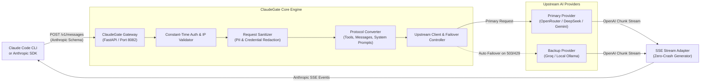

<p align="center">
  
</p>

<h1 align="center">ClaudeGate</h1>

<p align="center">
  <strong>High-Performance Universal Bridge connecting Claude Code CLI & Anthropic SDKs to ANY AI Model.</strong><br>
  <em>Zero-crash streaming, multi-provider failover, chain-of-thought sanitization, PII redactor, and 24+ provider presets.</em>
</p>

<p align="center">
  
  
  
  
</p>

---

## 📑 Table of Contents

- [📌 1. Project Overview](#-1-project-overview)
- [📸 2. Live Demo & Terminal Previews](#-2-live-demo--terminal-previews)
- [✨ 3. Features](#-3-features)
- [🛠️ 4. Tech Stack](#️-4-tech-stack)
- [🏗️ 5. Architecture](#️-5-architecture)
- [📁 6. Project Structure](#-6-project-structure)
- [⚙️ 7. Installation and Setup](#️-7-installation-and-setup)
- [🚀 8. Usage & User Flow](#-8-usage--user-flow)
- [🧪 9. Testing & Diagnostics](#-9-testing--diagnostics)
- [🔒 10. Security & Privacy Safeguards](#-10-security--privacy-safeguards)
- [💡 11. Engineering Decisions](#-11-engineering-decisions)
- [🔮 12. Limitations and Future Improvements](#-12-limitations-and-future-improvements)
- [🤝 13. Contributing & Code of Conduct](#-13-contributing--code-of-conduct)
- [📄 14. License](#-14-license)

---

## 📌 1. Project Overview

[Claude Code CLI](https://docs.anthropic.com/en/docs/agents-and-tools/claude-code/overview) is one of the most capable agentic coding tools available today. However, it is natively locked to Anthropic's commercial cloud endpoints.

**ClaudeGate** is a lightweight, high-throughput, and secure local API gateway that bridges Anthropic's Messages API protocol (`/v1/messages` and `/v1/messages/count_tokens`) into standard OpenAI-compatible Chat Completions. 

With ClaudeGate, developers can power Claude Code CLI, Cursor, and Anthropic SDK applications using:
- 🆓 **Free & Frontier AI Cloud Models**: Stealth Ox Alpha, OpenRouter (Claude Opus 5 / Sonnet 5 / Haiku 4.5), OpenAI (GPT-5.6 Sol / Terra / Luna), DeepSeek (V4-Pro & V4-Flash), Google Gemini (3.1 Pro / 3.7 Flash / 3.5 Flash-Lite), Alibaba Qwen (Qwen3.8-Max / Qwen3.7-Plus / Qwen3.8-27B), Moonshot Kimi (K3 2.8T & K2.7 Code), Meta (Muse Spark 1.2 & Muse Glimmer), Z.ai GLM (GLM-5.3 & GLM-5-Turbo), MiniMax (M3 & M2.7), Cohere (Command A+ / A / R7B), Mistral (Large 3 / Medium 3.5 / Small 4), Perplexity (Sonar Reasoning Pro).
- 🔒 **100% Private Local Offline Models**: Ollama, LM Studio, vLLM (DeepSeek V4-Pro quantized, Qwen3.6-35B-A3B, Muse Glimmer - zero data leaves your machine).
- 🧠 **Next-Gen Model Mapping**: Seamlessly routes all Claude versions (Claude 3.5, 3.7, 4.x, 4.5, 5.x, Fable, Mythos) to your configured `BIG_MODEL`, `MIDDLE_MODEL`, and `SMALL_MODEL` tiers or passes through direct model slugs.
- 🏢 **Enterprise Private Deployments**: Azure OpenAI Service, AWS Amazon Q (via Kiro Bridge), Meta Muse Spark.

---

## 📸 2. Live Demo & Terminal Previews

ClaudeGate in active operation, translating Claude Code CLI tool calls, bash commands, and streaming tokens in real-time:

<div align="center">
  <table>
    <tr>
      <td align="center" width="50%">
        <strong>⚡ ClaudeGate Proxy Gateway</strong><br>
        
      </td>
      <td align="center" width="50%">
        <strong>🤖 Claude Code CLI in Action</strong><br>
        
      </td>
    </tr>
  </table>
</div>

---

## ✨ 3. Features

- ⚡ **Zero-Crash SSE Streaming**: Translates raw OpenAI chunk streams into Anthropic Server-Sent Events (`content_block_start`, `content_block_delta`, `message_delta`, `message_stop`). Mid-stream disconnects and upstream errors are caught gracefully without crashing Starlette/ASGI.
- 🔄 **Automatic Multi-Provider Failover**: Seamlessly fails over from primary upstream to backup providers (e.g. OpenRouter $\rightarrow$ Groq $\rightarrow$ local Ollama) on transient `503`, `429`, or timeout errors without dropping the active client session.
- 🛡️ **PII & Secret Sanitizer**: Intercepts outgoing prompts and automatically scrubs AWS keys, GitHub PATs, OpenAI tokens, and SSH private keys before requests leave your computer (`SANITIZE_SECRETS=true`).
- 🛠️ **Full Bi-directional Tool / Function Calling**: Seamlessly translates Claude Code file-system operations, terminal commands, and search tools into OpenAI function calls and vice versa.
- 🧹 **Chain-of-Thought / `<thinking>` Sanitizer**: Cleanses internal reasoning tokens and `<thinking>` blocks from conversation history so multi-turn reasoning models (like DeepSeek R1/V4) never trigger `400 Bad Request` errors on follow-up turns.
- ⏳ **Extended 10-Minute Keep-Alive**: Tuned TCP socket lifespan (`timeout_keep_alive=600`) to prevent Node.js `ECONNRESET` drops during prolonged user typing pauses.
- 🎛️ **Universal CLI Tooling**: Interactive setup wizard (`--setup`), live connectivity diagnostic (`--test`), and 24+ instant preset switches (`--preset <name>`).
- 🐳 **Docker & Compose Ready**: Run as a standalone daemon container with health-check monitoring.

---

## 🛠️ 4. Tech Stack

- **Backend Framework**: [FastAPI](https://fastapi.tiangolo.com/) (High-performance async ASGI web framework)
- **ASGI Server**: [Uvicorn](https://www.uvicorn.org/) (Configured with custom socket keep-alives and signal handling)
- **Data Validation & Schemas**: [Pydantic v2](https://docs.pydantic.dev/) (Strict type serialization for Anthropic & OpenAI payloads)
- **HTTP Clients**: [httpx](https://www.python-httpx.org/) & [openai-python](https://github.com/openai/openai-python) (Async connection pooling and streaming response parsing)
- **Security & Crypto**: Python `hmac` (Constant-time token authentication) and Regex Token Redaction Engine
- **Containerization**: Docker & Docker Compose (Multi-stage Python slim base image)

---

## 🏗️ 5. Architecture

ClaudeGate sits transparently between Claude Code CLI and your chosen AI model provider:



---

## 📁 6. Project Structure

```text
ClaudeGate/
├── assets/                    # Visual assets and screenshots
│   ├── ClaudeGate.png         # Project Banner & Logo
│   ├── claude_terminal_ss.png # Claude Code CLI in action
│   └── proxy_terminal.png     # ClaudeGate terminal proxy log
├── Dockerfile                 # Container image specification
├── docker-compose.yml         # Container service configuration
├── requirements.txt           # Python package dependencies
├── pyproject.toml             # Modern package build configuration
├── setup.py                   # Legacy pip install compatibility
├── start_proxy.py             # CLI & Server launcher script
├── .env.example               # Comprehensive environment template
├── LICENSE                    # MIT License
├── SECURITY.md                # Security policy & reporting guidelines
├── CODE_OF_CONDUCT.md         # Community standard of conduct
├── CONTRIBUTING.md            # Contribution guidelines
├── CHANGELOG.md               # Version release history
├── README.md                  # Project documentation
│
├── presets/                   # Ready-to-use provider templates
│   ├── openrouter.env         # OpenRouter (Claude Opus 5, Sonnet 5, Haiku 4.5)
│   ├── groq.env               # Groq (DeepSeek V4-Pro, Llama 4 Maverick, Muse Glimmer)
│   ├── ollama.env             # Ollama (100% Local DeepSeek V4-Pro, Qwen3.6-35B, Muse Glimmer)
│   ├── deepseek.env           # DeepSeek (DeepSeek V4-Pro & V4-Flash)
│   ├── gemini.env             # Google Gemini (Gemini 3.1 Pro, 3.7 Flash & 3.5 Flash-Lite)
│   ├── openai.env             # OpenAI Official (GPT-5.6 Sol, GPT-5.6 Terra, GPT-5.6 Luna)
│   ├── kimi.env               # Moonshot AI (Kimi K3 2.8T Reasoning & K2.7 Code)
│   ├── qwen.env               # Alibaba Qwen / DashScope (Qwen3.8-Max, Qwen3.7-Plus, Qwen3.8-27B)
│   ├── mistral.env            # Mistral AI (Mistral Large 3, Mistral Medium 3.5, Mistral Small 4)
│   ├── perplexity.env         # Perplexity (Sonar Reasoning Pro, Sonar Pro & Sonar)
│   ├── cohere.env             # Cohere (Command A+, Command A & Command R7B)
│   ├── minimax.env            # MiniMax (MiniMax M3 Frontier & MiniMax M2.7)
│   ├── meta.env               # Meta AI (Muse Spark 1.2, Llama 4 Maverick, Muse Glimmer)
│   ├── zai.env                # Z.ai / Zhipu GLM (GLM-5.3 Flagship, GLM-5-Turbo, GLM-4.7-Flash)
│   ├── together.env           # Together AI (DeepSeek V4-Pro, DeepSeek V4-Flash, Qwen3.8-27B)
│   ├── fireworks.env          # Fireworks AI (DeepSeek V4-Pro, DeepSeek V4-Flash, Qwen3.8-27B)
│   ├── cerebras.env           # Cerebras (DeepSeek V4-Pro, Llama 4 Maverick, Muse Glimmer)
│   ├── sambanova.env          # SambaNova Cloud (DeepSeek V4-Pro, Llama 4 Maverick, Qwen3.8-27B)
│   ├── siliconflow.env        # SiliconFlow (DeepSeek V4-Pro, DeepSeek V4-Flash, Qwen3.8-27B)
│   ├── lmstudio.env           # LM Studio Desktop (DeepSeek V4-Pro & Muse Glimmer)
│   ├── vllm.env               # vLLM Self-Hosted GPU (DeepSeek V4-Pro & Qwen3.6-35B)
│   ├── azure.env              # Azure OpenAI Service (o1 & GPT-5.6 Enterprise Deployments)
│   ├── kiro.env               # AWS Amazon Q Developer / Claude Opus 5 Bridge
│   ├── ox.env                 # Stealth Ox Alpha (Frontier Reasoning Model)
│   └── nemotron.env           # Nvidia Nemotron Free Tier
│
├── scripts/                   # Verification & test utilities
│   ├── verify_failover.py     # Automated failover simulation runner
│   └── test_live_nemotron_ox.py # Live dual-model probe (Nemotron & Ox Alpha)
│
└── src/                       # Source code
    ├── main.py                # FastAPI app & Uvicorn lifecycle
    ├── cli.py                 # CLI commands, setup wizard & test runner
    ├── api/
    │   └── endpoints.py       # /v1/messages, /health & /count_tokens routes
    ├── conversion/
    │   ├── request_converter.py   # Anthropic -> OpenAI message & tool parsing
    │   └── response_converter.py  # OpenAI stream -> Anthropic SSE translation
    ├── core/
    │   ├── client.py          # Async client with failover & retry logic
    │   ├── config.py          # Dynamic environment loader & constant-time auth
    │   ├── constants.py       # Anthropic & OpenAI protocol constants
    │   ├── logging.py         # Structured logging configuration
    │   └── model_manager.py   # Intelligent model tier & slug router
    ├── models/
    │   ├── claude.py          # Pydantic schemas for Anthropic API
    │   └── openai.py          # Pydantic schemas for OpenAI API
    └── security/
        └── sanitizer.py       # Secret, AWS key, and PAT redaction engine
```

---

## ⚙️ 7. Installation and Setup

### Step 1: Clone Repository & Create Environment
```bash
git clone https://github.com/Santosh-Prasad-Verma/ClaudeGate.git
cd ClaudeGate

python3 -m venv .venv
source .venv/bin/activate
pip install -r requirements.txt
```

### Step 2: Configure Your Upstream Provider
Launch the interactive configuration wizard:
```bash
python start_proxy.py --setup
```
*Or load a ready-made preset directly:*
```bash
python start_proxy.py --preset openrouter
```

### Step 3: Configure Claude Code CLI
You can configure Claude Code CLI to communicate with ClaudeGate using either **Permanent** or **Session-Based** configuration:

#### Option A: Permanent Configuration (Recommended)
Edit (or create) `~/.claude/settings.json` to automatically route all future `claude` commands to ClaudeGate:
```json
{
  "env": {
    "ANTHROPIC_BASE_URL": "http://127.0.0.1:8082",
    "ANTHROPIC_API_KEY": "sk-claudegate-local"
  }
}
```

#### Option B: Session-Based (Current Terminal Only)
Export the variables in your active shell before launching Claude:
```bash
export ANTHROPIC_BASE_URL="http://127.0.0.1:8082"
export ANTHROPIC_API_KEY="sk-claudegate-local"
```

### Step 4: ✅ Verify It's Running
Run the built-in diagnostic test to verify your upstream provider connection and measure latency:
```bash
python start_proxy.py --test
```
*Expected Output:*
```text
🔍 Testing upstream connection...
   Provider Base URL: https://openrouter.ai/api/v1
   Test Model:        stealth/ox-alpha
✅ Connection Successful! Model is active and responsive.
   Status: 200 OK
```

You can also probe the gateway health endpoint directly from your terminal:
```bash
curl http://127.0.0.1:8082/health
# {"status":"healthy","service":"claudegate"}
```

---

## 🚀 8. Usage & User Flow

### 🧭 End-to-End User Flow (How It Works in Practice)

Once setup is complete, your day-to-day workflow looks like this:

```text
┌─────────────────────────────────────────────────────────────────────────────┐
│  TERMINAL 1: Start ClaudeGate Gateway Daemon                                │
│  $ cd ClaudeGate && python start_proxy.py                                   │
│  [Gateway listening on http://127.0.0.1:8082 (OpenRouter/Groq/Ollama)]       │
└──────────────────────────────────────┬──────────────────────────────────────┘
                                       │ (Translates Anthropic ⟷ OpenAI protocol)
                                       ▼
┌─────────────────────────────────────────────────────────────────────────────┐
│  TERMINAL 2: Your Codebase Workspace (Run Claude Code)                       │
│  $ cd /path/to/my-project                                                   │
│  $ claude                                                                   │
│                                                                             │
│  > "Add JWT authentication to src/auth.py and run the unit tests"           │
│                                                                             │
│  Claude Code ──────► ClaudeGate (8082) ──────► DeepSeek R1 / Qwen / Groq    │
│  (CLI Tool Calls)   (Translates schemas)       (Executes inference & tools) │
│  ◄────────────────── (Streams SSE Events) ◄──────────────────────────────── │
│                                                                             │
│  ✅ Claude Code automatically reads files, writes code, and runs bash tests! │
└─────────────────────────────────────────────────────────────────────────────┘
```

#### Step-by-Step Daily Execution:

1. **Start the Gateway (Terminal 1)**:
   ```bash
   cd ClaudeGate
   python start_proxy.py
   ```
   *ClaudeGate will boot up, display active model mappings, and listen on `http://127.0.0.1:8082`.*

2. **Open Your Coding Project (Terminal 2)**:
   Navigate to whatever software project or repo you want to work on:
   ```bash
   cd ~/my-flutter-app   # or any project directory
   ```

3. **Launch Claude Code**:
   ```bash
   claude
   ```
   *You can now type natural language instructions as usual. Claude Code will execute file inspections, bash commands, multi-file edits, and git commits powered entirely by your chosen backend model!*

4. **Switching Models On The Fly**:
   Want to swap from free cloud models (OpenRouter) to 100% private offline models (Ollama)?
   In Terminal 1:
   ```bash
   python start_proxy.py --preset ollama
   python start_proxy.py
   ```
   *Claude Code in Terminal 2 will immediately begin routing through local Ollama without needing a restart.*

---

### 💻 CLI Utilities & Commands

| Command | Purpose |
|---|---|
| `python start_proxy.py` | Start the ClaudeGate server |
| `python start_proxy.py --test` | Run live connectivity probe & measure upstream latency |
| `python start_proxy.py --setup` | Launch interactive 24-provider setup wizard |
| `python start_proxy.py --preset <name>` | Quick-load a preset (e.g. `groq`, `gemini`, `ollama`, `deepseek`) |
| `python start_proxy.py --help` | View help and available options |
| `python start_proxy.py --version` | Display current release version |

---

### 🐳 Running with Docker

If you prefer to run ClaudeGate as a background Docker container:

```bash
# Build and start container in the background
docker compose up -d --build

# View real-time logs
docker compose logs -f

# Check container health status
docker ps

# Stop container
docker compose down
```

---

## 🧪 9. Testing & Diagnostics

ClaudeGate includes built-in live diagnostics and automated test suites:

### 1. Upstream Connectivity & Latency Probe
Test your active model and measure upstream response latency:
```bash
python start_proxy.py --test
```
*Output:*
```text
🔍 Testing upstream connection...
   Provider Base URL: https://openrouter.ai/api/v1
   Test Model:        stealth/ox-alpha
✅ Connection Successful! Model is active and responsive.
   Status: 200 OK
```

### 2. Multi-Provider Fallback Verification
Simulate an upstream outage to test automatic failover:
```bash
python scripts/verify_failover.py
```

### 3. Automated Pytest Suite
Run the full test suite covering non-streaming failover, SSE streaming, and endpoint security:
```bash
pytest tests/ -v
```

---

## 🔒 10. Security & Privacy Safeguards

ClaudeGate implements defense-in-depth privacy controls to ensure secure self-hosting:

- **Localhost-Only Default (`127.0.0.1`)**: Restricts incoming traffic exclusively to the local machine.
- **Constant-Time Authentication**: Uses Python's `hmac.compare_digest` to validate `x-api-key` headers, preventing side-channel timing analysis.
- **Secret & PII Redaction Engine**: When `SANITIZE_SECRETS="true"`, prompts are automatically scrubbed for sensitive tokens (GitHub PATs, AWS Access Keys, OpenAI Keys, Private SSH keys) before reaching upstream providers.
- **Vulnerability Reporting**: For responsible disclosure, please refer to our [Security Policy](SECURITY.md).

---

## 💡 11. Engineering Decisions

1. **Error Markers over Generator Exceptions**:
   - *Problem*: In Starlette / FastAPI, raising `HTTPException` inside an active `StreamingResponse` async generator after HTTP headers (`200 OK`) are flushed causes a fatal `RuntimeError: response already started` and terminates the ASGI worker.
   - *Decision*: ClaudeGate's generator yields formatted `ERROR::<status>::<message>` tokens that the SSE converter catches and translates into standard Anthropic error events, keeping the worker process healthy.

2. **Multi-Turn `<thinking>` Cleansing**:
   - *Problem*: Reasoning models (like DeepSeek R1) output reasoning tokens. When Claude Code sends subsequent conversation turns containing these blocks in history, standard OpenAI endpoints reject the payload with `400 Bad Request`.
   - *Decision*: The `request_converter` automatically identifies and filters `thinking` and `redacted_thinking` content blocks before dispatching to upstream providers.

3. **Constant-Time Client Authentication**:
   - *Problem*: Standard string comparisons (`key == expected`) are susceptible to side-channel timing attacks.
   - *Decision*: Implemented `hmac.compare_digest` across all header validation points.

4. **10-Minute TCP Keep-Alive (`timeout_keep_alive=600`)**:
   - *Problem*: Node.js HTTP agents in Claude Code CLI drop connections with `ECONNRESET` if an interactive user takes longer than 5 seconds between prompts.
   - *Decision*: Configured explicit keep-alive headers and Uvicorn socket timeouts to support extended interactive developer pauses.

---

## 🔮 12. Limitations and Future Improvements

### Current Limitations
- **Image Input Format**: Multimodal image support currently converts Base64 images directly; URLs require public accessibility.
- **Provider-Specific Parameters**: Non-standard hyperparameters outside temperature and top_p are passed as standard OpenAI extensions.

### Roadmap & Future Improvements
- [ ] **Real-Time Web Dashboard**: Built-in visual UI (`http://127.0.0.1:8082/dashboard`) for live latency charts, token velocity, and cost tracking.
- [ ] **Prompt Cache & SQLite Deduplication**: In-memory and SQLite KV caching for repetitive codebase index prompts.
- [ ] **Dynamic Complexity Router**: Automatic classification of task difficulty (e.g. routing simple edits to Groq and complex architectural refactors to DeepSeek R1).
- [ ] **Unix Domain Sockets (UDS)**: Zero-network communication option over `/run/user/$UID/claudegate.sock`.

---

## 🤝 13. Contributing & Code of Conduct

We welcome bug fixes, documentation improvements, new provider presets, and feature additions!

- **Contributing Guide**: Check out [CONTRIBUTING.md](CONTRIBUTING.md) for local environment setup and PR workflows.
- **Code of Conduct**: This project follows the [Contributor Covenant v2.1](CODE_OF_CONDUCT.md).
- **Adding Presets**: To contribute a new preset, add `presets/<provider_name>.env` and submit a pull request!

---

## 📄 14. License

Distributed under the **MIT License**. See [LICENSE](LICENSE) for more information.

---

<p align="center">
  
</p>

<p align="center">
  <strong>Built with ❤️ for the open-source & AI developer community.</strong><br>
  <em>Empowering developers to run Claude Code with any model, anywhere, completely unrestricted.</em>
</p>

<p align="center">
  ⭐ <strong>If you find ClaudeGate useful, consider giving it a star on GitHub!</strong> ⭐
</p>
